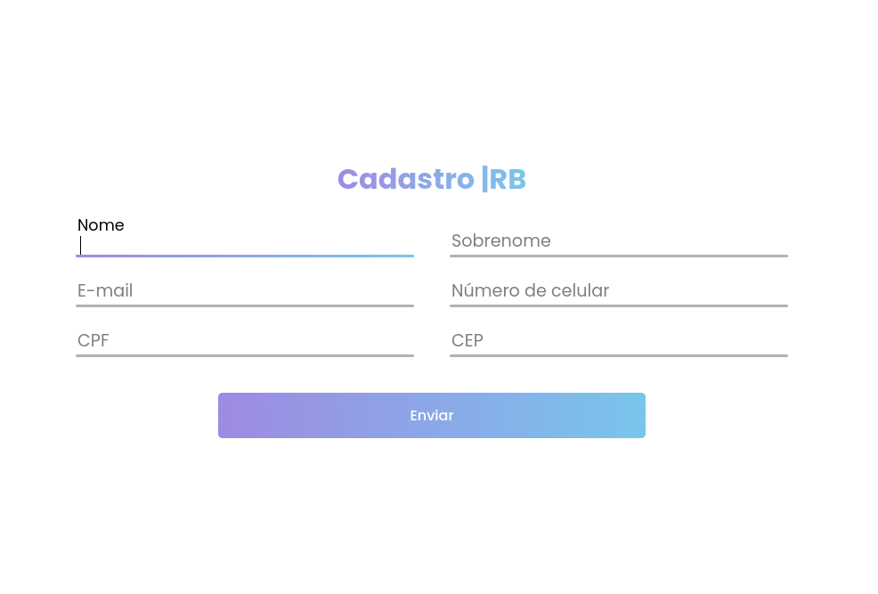

# Modelo Formulário 

Um modelo de formulário desenvolvido com HTML, JavaScript e jQuery, com tarefas automatizadas usando Grunt e estilos aplicados via Less.
O projeto utiliza as bibliotecas jQuery Validate para validação de campos e jQuery Mask para formatação dos inputs, 
garantindo uma experiência de usuário aprimorada e mais intuitiva ao preencher o formulário.
 
 

## Tecnologias Utilizadas

&nbsp;
&nbsp;
&nbsp;
&nbsp;
&nbsp;

 
 

## Link Demo: [Modelo Formulário](https://projeto-form-eight.vercel.app/)

  

